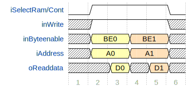
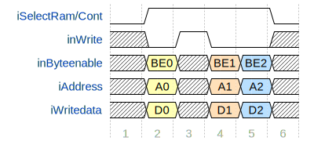
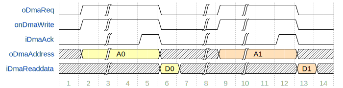
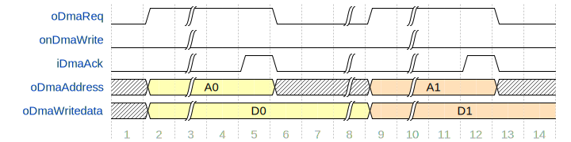

OpenMAC Toplevel Documentation {#openmac}
==============================

[TOC]

# Introduction {#sec-intro}
OpenMAC is an open-source IP-Core implemented in VHDL '93.
It can be synthesized for Altera and Xilinx FPGA platforms, however, the
target-specific components (e.g. dpRam) can be ported easily to other targets.

The MAC includes a full transmitter (Tx) and receiver (Rx) – therefore its
full-duplex ability is enabled.
All frames will be fetched or stored from or into a memory via the included DMA.
The MAC's descriptors are located in a Dual Port Ram (DPR, 16/16) setting the
frame buffer's locations. This memory is accessible over a memory mapped slave interface.

To enable the hardware acceleration ability, a frame filter is included.
This component compares the first 31 Bytes of a received frame and
starts a transmission of a defined frame from the memory after the
Inter Frame Gap (960ns, 100Mbps) or a configured delay.
It is possible to configure 16 different frame filters and
set for every filter the "Auto-Response Feature".

Every received and transmitted frame gets a time stamp from a 32 Bit Counter and
can be read from the descriptor-memory.
The Counter value can be used to generate time-dependent interrupts.

The openMAC is equipped with one RMII and can be connected to an external Phy directly.
Optionally a three-port (or larger) hub can be used (openhub) to attach more Phys.
Every used Phy can be configured and monitored via the Serial Management Interface
with the Phy Management Interface Core (phyMgmt).
The HAL driver automatically detects the connected Phys on the SMI bus-line.

It is recommended to use the provided distortion filter (openfilter)
to lock out noise from the connected network.
This core should be positioned between the MAC and the Phy or between the MAC and
the Hub.

## Features {#sec-features}
* sparse hardware resources
* full- and half- duplex 100Mbps MAC
* RMII (reduced media independent interface)
* n-port hub (openhub)
* 16 Rx filters with the ability to start a transmission
* First 31 bytes are filtered by the Rx filters
* auto-response feature
* low through-put time
* 32bit free-running timer for time-stamps (Rx and Tx) and IRQ generation
* Distortion filter (openfilter)
* IPG of auto-response frames are adjustable (necessary for Poll-Response Chaining)
* FPGA-internal Tx/Rx frame buffer
* Timer-triggered frame transmission (beneficial for low SoC jitter by POWERLINK MN)

# openMAC {#sec-openmac}
This section describes the IP-Core openmac.

## Interface {#sec-openmac_interface}
The openMAC's interface to the host processor enables access to Tx/Rx descriptors,
status and command registers. The whole IP-Core uses a common clock source, which
is the RMII phy clock.

The RAM_BASE memory region can be accessed by asserting the openmac.iSelectRam signal.
The CONT_BASE memory region can be accessed by asserting the openmac.iSelectCont signal.

### Descriptor Block {#sec-openmac_interface_descr}
Every descriptor includes information about the received- or (to be) transmitted
frames, like the address to the buffer, the length and some status flags.
The Tx- and Rx-descriptors are located in the MAC's dual-port-RAM (dpRam),
which enables fast access (without CPU-control) by the MAC with the RMII Ref-CLK (openmac.iClk, 50MHz).
This block has a size of 512 Bytes and is divided into Tx- and Rx-descriptors.
The openMAC supports 16 Tx- and 16 Rx-descriptors.

Address    |   31.. 0
---------- | ---------
RAM_BASE + 0x05FC | TX_DESC[15].[timeStamp](#sec-openmac_interface_descr_timeStamp)
RAM_BASE + 0x05F8 | TX_DESC[15].[startTime](#sec-openmac_interface_descr_startTime)
RAM_BASE + 0x05F4 | TX_DESC[15].[framePointer](#sec-openmac_interface_descr_framePointer)
RAM_BASE + 0x05F0 | TX_DESC[15].[status](#sec-openmac_interface_descr_txStatus)
...               | ...
RAM_BASE + 0x050C | TX_DESC[0].[timeStamp](#sec-openmac_interface_descr_timeStamp)
RAM_BASE + 0x0508 | TX_DESC[0].[startTime](#sec-openmac_interface_descr_startTime)
RAM_BASE + 0x0504 | TX_DESC[0].[framePointer](#sec-openmac_interface_descr_framePointer)
RAM_BASE + 0x0500 | TX_DESC[0].[status](#sec-openmac_interface_descr_txStatus)
RAM_BASE + 0x04FC | RX_DESC[15].[timeStamp](#sec-openmac_interface_descr_timeStamp)
RAM_BASE + 0x04F8 | RX_DESC[15].RESERVED
RAM_BASE + 0x04F4 | RX_DESC[15].[framePointer](#sec-openmac_interface_descr_framePointer)
RAM_BASE + 0x04F0 | RX_DESC[15].[status](#sec-openmac_interface_descr_rxStatus)
...               | ...
RAM_BASE + 0x040C | RX_DESC[0].[timeStamp](#sec-openmac_interface_descr_timeStamp)
RAM_BASE + 0x0408 | RX_DESC[0].RESERVED
RAM_BASE + 0x0404 | RX_DESC[0].[framePointer](#sec-openmac_interface_descr_framePointer)
RAM_BASE + 0x0400 | RX_DESC[0].[status](#sec-openmac_interface_descr_rxStatus)

The available buffer length of a Rx-descriptor may be set to maximal 1518 Bytes.
It should be set to an even number and before using this descriptor.
The Rx-length includes the CRC-field (4 Bytes), so the host needs to subtract it by itself.
If the Rx-length was exceeded (e.g. length was set to 512 Bytes,
but a packet with 1024 Bytes was received) the status flag OVERSIZEERR
(in the Rx-descriptor's status register) will be set. The odd data won't be
written to the RAM, but the MAC performs a CRC control and sets the CRCERR bit if necessary.
The host needs to pay attention on the Tx-packet-length. In case of Tx Frame Length shorter than
60 Bytes, the MAC sends an invalid frame with the set length.
Thus, the host must set the minimum length of 60 Bytes and set the padding bytes to zero.
The frame pointer (valid for Tx and Rx) needs to point at a word address (word alignment).
After transmission the Tx frame length is set to the sent bytes or to the byte number
when the collision occurs (e.g. collision with the first byte => TXCOL = 0).
The time stamp register will be set by starting the Tx preamble or receiving
the SOF (start of frame). The value's source is a free-running 32 bit counter (50MHz).
When collisions are allowed the time of the last try is recorded in the time stamp.
In the Tx-descriptor status register the bits 8 and 9 (and also 11 to 15) will be set to zero,
after successfully sending a frame.
When writing on the descriptor the bit WRITTEN will be set.
So it is possible to recognize the Tx-packets end independent of the Owner bit.

#### Time stamp {#sec-openmac_interface_descr_timeStamp}
The time stamp field is set to the 32 bit timer value (openmac.oMacTime) when a
frame was received or transmitted. The value bases on 20 ns ticks.

|  31.. 0    |
| ---------- |
| TIMETICK |

#### Start time {#sec-openmac_interface_descr_startTime}
The start time field is used by the MAC if the corresponding Tx status register
enables the start time flag. It determines the transmission of the frame at the
absolute time of the 32 bit timer (openmac.oMacTime).

|  31.. 0    |
| ---------- |
| STARTTIME |

#### Frame pointer {#sec-openmac_interface_descr_framePointer}
The frame pointer field references to the corresponding Rx or Tx frame.

|  31.. 0    |
| ---------- |
| FRAMEPOINTER |

#### Tx status {#sec-openmac_interface_descr_txStatus}
The Tx status field holds control/status flags (upper 16 bit) and the frame's
length (lower 16 bit)

|  31..16    |  15.. 0  |
| ---------- | -------- |
| CONTROL/STATUS | LENGTH |

Bit | Name  | Default   | Description
--- | ----- | --------- | -----------
30 | STARTTIME | 0      | Consider [STARTTIME](#sec-openmac_interface_descr_startTime) to start Tx at absolute time
28 | DELAY | 0          | Add delay to auto-response Tx by considering [STARTTIME](#sec-openmac_interface_descr_startTime)
26 | WRITTEN | 0        | If this bit is set, Tx is completed.
25 | LAST | 0           | This bit marks the last descriptor.
24 | OWNER | 0          | The owner bit marks the descriptor ownership. If set MAC is the owner.
19..16 | TXCOL | 0      | This count value gives the number of retries/collisions.
15.. 0 | LENGTH | 0     | Length of Tx frame to be transmitted

#### Rx status {#sec-openmac_interface_descr_rxStatus}
The Tx status field holds control/status flags (upper 16 bit) and the frame's
length (lower 16 bit)

|  31..16    |  15.. 0  |
| ---------- | -------- |
| CONTROL/STATUS | LENGTH |

Bit | Name  | Default   | Description
--- | ----- | --------- | -----------
28 | ALIGNERR | 0       | Is set if the received frame is not byte-aligned.
27..26 | HUBPORT | 0    | Represents the hub port number that has received the frame.
25 | LAST | 0           | This bit marks the last descriptor.
24 | OWNER | 0          | The owner bit marks the descriptor ownership. If set MAC is the owner.
23..20 | FILTER | 0     | References to the filter that accepts the received frame.
19 | NOISEERR | 0       | This error bit identifies invalid Rx signals (e.g. openmac.iRxDv toggles).
18 | PREERR | 0         | This error bit is asserted in case of an incorrect preamble format.
17 | OVERSIZEERR | 0    | This error bit is asserted if the received frame is cut due to insufficient frame buffer length.
16 | CRCERR | 0         | This error bit is set if the received CRC is invalid.
15.. 0 | LENGTH | 0     | Length of frame buffer / received frame

### Status/Control Registers {#sec-openmac_interface_statusControl}

The status/control registers are accessible directly (TXREG and RXREG) or through
SET/CLR registers to set or reset individual bits.

Address |   15.. 0
------- | ---------
CONT_BASE + 0x000E | [RXREG_DESCPTR](#sec-openmac_interface_statusControl_rxregdescptr)
CONT_BASE + 0x000C | [RXREG_CLR](#sec-openmac_interface_statusControl_rxregclr)
CONT_BASE + 0x000A | [RXREG_SET](#sec-openmac_interface_statusControl_rxregset)
CONT_BASE + 0x0008 | [RXREG](#sec-openmac_interface_statusControl_rxreg)
CONT_BASE + 0x0006 | [TXREG_DESCPTR](#sec-openmac_interface_statusControl_txregdescptr)
CONT_BASE + 0x0004 | [TXREG_CLR](#sec-openmac_interface_statusControl_txregclr)
CONT_BASE + 0x0002 | [TXREG_SET](#sec-openmac_interface_statusControl_txregset)
CONT_BASE + 0x0000 | [TXREG](#sec-openmac_interface_statusControl_txreg)

**The Descriptor Pointer may only be set when the RUN bit is set to zero!**
An interrupt (TX) occurs when the first transmission try was successful or
16 collisions happened. With setting the RUN bit to one transmitter and receiver blocks are enabled.
The IE bit should be set to enable interrupts.
When an interrupt occurs the IRQPEN field will be incremented (per interrupt).
To acknowledge the interrupt, the host needs to set IRQACK.
This will decrement the Interrupt Pending field.
The interrupt will be set until the IRQPEN field is zero or the IE bit is cleared.
This logic makes sure to not lose any interrupt or execute it twice.
After the Interrupt was acknowledged, the descriptor pointer will be set to the
next descriptor, which may be owned by the MAC
(to send the packet or copy the next received frame into its buffer).
The bit LOST will be set, when a frame was received, but the RUN bit was set
to zero or there was no descriptor for the MAC available (every OWNER was zero).
The idle bits are set to one, if there is no transmission or reception active.

#### Tx Register (RW) {#sec-openmac_interface_statusControl_txreg}

| 15.. 0    |
| --------- |
| TXREG |

Bit | Name  | Default   | Mode | Description
--- | ----- | --------- | ---- | -----------
15  | IE    | 0         | RW   | Enable Tx interrupts
13  | HALF  | 0         | RW   | Enable half-duplex mode (deactivated for full-duplex)
11.. 8 | IRQPEN | 0     | RO   | Number of pending Tx interrupts
7   | RUN   | 0         | RW   | Enable Tx block
5   | IDLE  | 0         | RO   | Tx block is idle (no Tx in progress)
3..0 | DESCPTR | 0      | RO   | Tx descriptor pointer (acknowledge with IRQACK)

#### Tx Register SET (SC) {#sec-openmac_interface_statusControl_txregset}

| 15.. 0    |
| --------- |
| TXREG_SET |

Bit | Name  | Default   | Mode | Description
--- | ----- | --------- | ---- | -----------
15  | IE    | 0         | SC   | Enable Tx interrupts
13  | HALF  | 0         | SC   | Enable half-duplex mode (deactivated for full-duplex)
7   | RUN   | 0         | SC   | Enable Tx block

#### Tx Register CLEAR (SC) {#sec-openmac_interface_statusControl_txregclr}

| 15.. 0    |
| --------- |
| TXREG_CLR |

Bit | Name  | Default   | Mode | Description
--- | ----- | --------- | ---- | -----------
15  | IE    | 0         | SC   | Disable Tx interrupts
13  | HALF  | 0         | SC   | Disable half-duplex mode (deactivated for full-duplex)
8   | IRQACK | 0        | SC   | Acknowledge a Tx interrupt (decrements pending counters)
7   | RUN   | 0         | SC   | Disable Tx block

#### Tx Register Descriptor Pointer (RW) {#sec-openmac_interface_statusControl_txregdescptr}

| 15.. 0    |
| --------- |
| TXREG_DESCPTR |

Bit | Name  | Default   | Mode | Description
--- | ----- | --------- | ---- | -----------
14  | SETIFG | 0        | RW   | Enable IFG field
13.. 8 | IFG | 0        | RW   | IFG field [ticks]
3..0 | DESCPTR | 0      | RW   | Tx descriptor pointer (only write to this register when RUN is 0)

#### Rx Register (RW) {#sec-openmac_interface_statusControl_rxreg}

| 15.. 0    |
| --------- |
| RXREG |

Bit | Name  | Default   | Mode | Description
--- | ----- | --------- | ---- | -----------
15  | IE    | 0         | RW   | Enable Rx interrupts
11.. 8 | IRQPEN | 0     | RO   | Number of pending Rx interrupts
7   | RUN   | 0         | RW   | Enable Rx block
5   | IDLE  | 0         | RO   | Rx block is idle (no Rx in progress)
4   | LOST  | 0         | RO   | Frame was received but RUN cleared or no descriptor available
3..0 | DESCPTR | 0      | RO   | Rx descriptor pointer (acknowledge with IRQACK)

#### Rx Register SET (SC) {#sec-openmac_interface_statusControl_rxregset}

| 15.. 0    |
| --------- |
| RXREG_SET |

Bit | Name  | Default   | Mode | Description
--- | ----- | --------- | ---- | -----------
15  | IE    | 0         | SC   | Enable Rx interrupts
7   | RUN   | 0         | SC   | Enable Rx block

#### Rx Register CLEAR (SC) {#sec-openmac_interface_statusControl_rxregclr}

| 15.. 0    |
| --------- |
| RXREG_CLR |

Bit | Name  | Default   | Mode | Description
--- | ----- | --------- | ---- | -----------
15  | IE    | 0         | SC   | Disable Rx interrupts
8   | IRQACK | 0        | SC   | Acknowledge a Rx interrupt (decrements pending counters)
7   | RUN   | 0         | SC   | Disable Rx block
4   | LOST  | 0         | SC   | Clear lost flag

#### Rx Register Descriptor Pointer (RW) {#sec-openmac_interface_statusControl_rxregdescptr}

| 15.. 0    |
| --------- |
| RXREG_DESCPTR |

Bit | Name  | Default   | Mode | Description
--- | ----- | --------- | ---- | -----------
3..0 | DESCPTR | 0      | RW   | Rx descriptor pointer (only write to this register when RUN is 0)

### Rx Filters {#sec-openmac_interface_rxfilter}

The openMAC provides 16 perfect Rx filters comparing the first 32 byte of an
Ethernet frame starting after the SFD (start of frame delimiter).
The filter logic requires a filter mask and value.

~~~{.vhd}
-- Filter logic ('0' ... frame matches the filter)
filterMatch(..) <= (rxData(..) xor filterValue(..)) and filterMask(..);
~~~

The MAC is using the RMII Interface, so per Clock only two bits are transmitted.
Therefore the filter needs to be executed within 4 clock cycles - in one cycle 4 filters are processed.
The processing starts after the 31st received byte with filter 0.
After the first match, the filter number will be set to a free Rx descriptor.
It is impossible to read the filter image directly, so the host has to store a
local copy of the filter configuration.
The filter is realized with a 16x32 bit RAM block. The 16 bit site is connected
to the host and the 32 bit site is connected to filter logic.
When the received message fits to the filter the COMMAND register will be interpreted.
If the COMMAND register's TXEN bit is set, the frame referenced by the TXDESC is
sent (when the owner is set to the MAC).

Address |   31..16  |   15.. 0
------- | --------- | ---------
RAM_BASE + 0x03FE | RESERVED    | COMMAND[15]
RAM_BASE + 0x03FC | MASK[15][30] | VALUE[15][30]
...               | ... | ...
RAM_BASE + 0x03C2 | MASK[15][1] | VALUE[15][1]
RAM_BASE + 0x03C0 | MASK[15][0] | VALUE[15][0]
...               | ... | ...
...               | ... | ...
RAM_BASE + 0x0042 | MASK[1][1] | VALUE[1][1]
RAM_BASE + 0x0040 | MASK[1][0] | VALUE[1][0]
RAM_BASE + 0x003E | RESERVED    | COMMAND[0]
RAM_BASE + 0x003C | MASK[0][30] | VALUE[0][30]
...               | ... | ...
RAM_BASE + 0x0002 | MASK[0][1] | VALUE[0][1]
RAM_BASE + 0x0000 | MASK[0][0] | VALUE[0][0]

|  7.. 0    |
| --------- |
| COMMAND[?] |

Bit | Name  | Default   | Description
--- | ----- | --------- | -----------
7 | TXEN | 0 | Enable auto-response when filter match.
6 | FLTON | 0 | Enable filter.
3.. 0 | TXDESC | 0 | Tx descritpor to be send when TXEN is set.

## Timing {#sec-openmac_timing}
The openMAC core implementation (openmac) provides a slave and a master interface.
The slave interface connects the host processor to configuration registers
and the MAC internal DPRAM (filter and descriptors). The master interface is
connected with the MAC DMA instance that issues frame transfers to the memory.

### Slave interface {#sec-openmac_timing_slave}
#### Read access
The interconnect master must assert the openmac.iSelectRam or openmac.iSelectCont
inputs to select either the RAM or status/control registers. In order to read data
openmac.inWrite must be set to HIGH during the access. Synchronously to asserting
the select and write strobes the address (openmac.iAddress) and byteenable
qualifiers (openmac.inByteenable) must be set valid. After one cycle delay the
valid data is presented at openmac.oReaddata.

#### Write access
In order to write to the slave interface the needed select signals (openmac.iSelectRam
or openmac.iSelectCont) must be set with a LOW level at openmac.inWrite.
Synchronously also a valid address, byteenables and the data to be written (openmac.iWritedata)
has to be provided to openmac. The write access is done in one cycle.

*Note that the write cycle of one must not be exceeded when writing to IRQACK
registers!*

### Master interface {#sec-openmac_timing_master}

#### Read access (Tx)
If the MAC issues a frame transmission, it requests a DMA transfer by asserting
openmac.oDmaReq and openmac.onDmaWrite. The interconnect must acknowledge the
successful transfer by asserting openmac.iDmaAck.
*Note that the valid data must be held at openmac.iDmaReaddata one cycle after
DMA transfer!*

#### Write access (Rx)
If the MAC receives a frame, it requests a DMA write transfer by asserting
openmac.oDmaReq and holding openmac.onDmaWrite LOW.
The valid data is provided with the assertion of openmac.oDmaReq.
If the interconnect has processed the request and data is written to memory,
the input openmac.iDmaAck must be asserted to signalize completion.
This clears the DMA request, however, the written data is still presented at
openmac.oDmaWritedata until the next transfer starts.

#### Hard real-time
The MAC transfers frames to the network by supporting hard real-time requirements.

**Therefore data must be fetched or forwarded by the DMA in time!**
If the MAC is used in half-duplex mode, every **8th cycle** (160 ns) a DMA request
is triggered. If the MAC is set to full-duplex mode, every **4th cycle** (80 ns) a
DMA transfer must be triggered.

**If the system cannot process the DMA requests in time, the overflow flag is
set (openmac.oDmaReqOverflow). Note that Rx data is not correctly transferred
to memory and Tx data is invalid!**

# Phy Management {#sec-phymgtm}
The Physical Interface (Phy) is identified, configured and controlled with SMI
(serial management interface, IEEE 802.3). It is possible to address 32 different Phys.

The transmission is done over a two-wire-connection with a clock wire and a pull-up data line.
So every Phy's SMI can be connected to one single line.

**Attention: Every Phy's Hardware Address must be unique on the SMI connection!**

The data exchange starts with 32 bits preamble (PRE) and two start bits (ST).
The operation code (OP) decides a write or read command. The next 10 bits
includes the Phy address (PHYAD) and the register address (REGAD).
Afterwards, there are two bits for turn around (TA) and then
the data will be transmitted (16 bit, MSBit first).

For more details refer to [Wikipedia](http://en.wikipedia.org/wiki/Management_Data_Input/Output)

## Interface
The Phy Management interface is implemented in phyMgmt. The host processor can access
its status/control registers via the memory mapped interface.

Address |  15..0
------- | -------
0x00 | SMI_CONTROL
0x02 | SMI_DATA
0x04 | PHY_RST

### SMI_CONTROL (READ)

 15  |  14  |  13  |  12  |  11  |  10  |  9  |  8  |  7  |  6  |  5  |  4  |  3  |  2  |  1  |  0
---- | ---- | ---- | ---- | ---- | ---- | --- | --- | --- | --- | --- | --- | --- | --- | --- | ---
 /   |  /   |  /   |  /   |  /   |   /  |  /  |  /  | NRST |  /  |  /  |  /  |  /  |  /  |  /  |  BUSY

Bit | Name  | Default   | Description
--- | ----- | --------- | -----------
7 | NRST | 0 | Phy reset (phyMgmt.onPhyReset)
0 | BUSY | 0 | SMI transfer in progress

### SMI_CONTROL (WRITE)

 15  |  14  |  13  |  12  |  11  |  10  |  9  |  8  |  7  |  6  |  5  |  4  |  3  |  2  |  1  |  0
---- | ---- | ---- | ---- | ---- | ---- | --- | --- | --- | --- | --- | --- | --- | --- | --- | ---
 0   |   1  | WR2  | WR1  | PHYADDR4 | PHYADDR3 | PHYADDR2 | PHYADDR1 | PHYADDR0 | REGNUM4 | REGNUM3 | REGNUM2 | REGNUM1 | REGNUM0 | WR0 | 0

Bit | Name  | Default   | Description
--- | ----- | --------- | -----------
15, 0 | 0 | 0 | This bit must be set to 0 when writing!
14 | 1 | 1 | This bit must be set to 1 when writing!

Name | Default | Description
---- | ------- | -----------
WR[2..0] | 0 | The write command must be set to "011" when writing to and "100" when reading from SMI.
PHYADDR[4..0] | 0 | The phy address to be transferred.
REGNUM[4..0] | 0 | The register number to be transferred.

### SMI_DATA (RW)

| 15..0 |
| ----- |
| SMI_DATA |

### PHY_RST (WRITE)

 15  |  14  |  13  |  12  |  11  |  10  |  9  |  8  |  7  |  6  |  5  |  4  |  3  |  2  |  1  |  0
---- | ---- | ---- | ---- | ---- | ---- | --- | --- | --- | --- | --- | --- | --- | --- | --- | ---
 /   |  /   |  /   |  /   |  /   |   /  |  /  |  /  | NRST |  /  |  /  |  /  |  /  |  /  |  /  |  /

Bit | Name  | Default   | Description
--- | ----- | --------- | -----------
7 | NRST | 0 | Phy reset (phyMgmt.onPhyReset)

## Timing {#sec-phymgmt_timing}

Refer to [openmac slave timing](#sec-openmac_timing_slave) for the phyMgmt access
timing.

# openHUB {#sec-openhub}
The openHUB is an RMII 100 Mbps Ethernet hub and can be configured to support
arbitrary number of ports (openhub.gPortCount).
If openhub is used in combination with openmac and openfilter, the same clock domain
must be allocated to openhub!
The hub supports an internal port which is usually connected to openmac (openhub.iIntPort).
If the internal port is specified the openhub.oRxPort provides the port number which
is receiving a frame. This port number can be used to filter out frames with openmac.
The hub supports to individually disable ports by setting a mask at openhub.iTxMask.

## Timing
TODO

# openFILTER {#sec-openfilter}
The openFILTER core is an RMII 100 Mbps Ethernet filter, avoiding to propagate
distortion over the network. The ipcore should be connected to every phy port
available holding off any incoming distortions on the Rx data lines.

**Important:** \n
**The openFILTER is an optional (but recommended) addition to openMAC.
However, please do not confuse openFILTER with the Rx frame filters in openMAC.** \n
**OpenFILTER does not observes the content of Ethernet frames!**

## Timing
TODO
