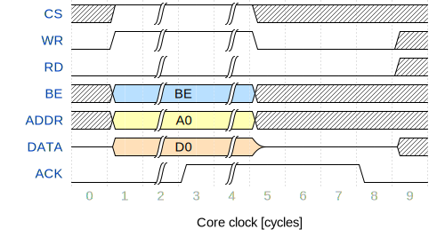
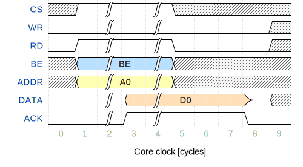
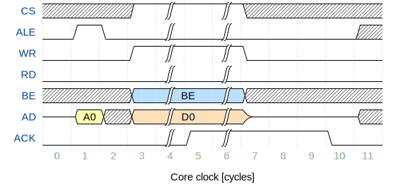
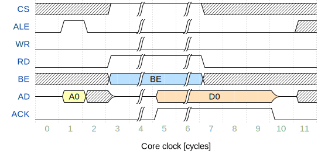

Parallel Interface IP-Core Documentation {#parallelif}
========================================

[TOC]

# Introduction {#sec-intro}

The parallel interface IP-Core (prlSlave) enables to connect via a generic bus
interface to the embedded system on an FPGA. The IP-Core is used in the open-source
industrial Ethernet protocol stack
[openPOWERLINK](http://sourceforge.net/projects/openpowerlink).

## Features {#sec-features}

* Generic address-data-bus interface
* Acknowledge strobe for dynamic wait state handling
* Configurable address and data width (prlSlave.gDataWidth and prlSlave.gAddrWidth)
* Possibility to use multiplexed address-data-bus interface (prlSlave.gEnableMux)
* Integration into Altera Qsys with Avalon Memory Mapped Master interface
* Timing constraint file for Altera Time Quest
* Tested with Altera Quartus 13.0sp1 tool chain

# Functional Description {#sec-func}

The parallel interface IP-Core acts as a bridge between an external bus master
(e.g. MCU with parallel interface) and the embedded system in the FPGA.
Within the embedded system the IP-Core acts as memory mapped master to access
memory mapped slaves. Seen from the external bus master instance the IP-Core's
role is a memory mapped slave.

The parallel interface can be configured to export the address-data-bus
multiplexed or demultiplexed (prlSlave.gEnableMux).
A multiplexed bus interface reduces the pin and trace counts since the address
and data bus share the same lines. Note that the address and data transfers are
carried out sequentially, thus, the interface's data throughput is reduced in
such configuration.
A demultiplexed interface configuration allows higher data throughput, however,
the pin count increases due to the separated address and data bus lines.

Note that the multiplex/demultiplex configuration is done at compile time!

The address- and data-width configuration shall be done depending on the
embedded system constrains. Also the pin count as well as the capabilities of
the external instance determine the width configuration.
If a demultiplexed configuration is used, the prlSlave.gDataWidth and
prlSlave.gAddrWidth generics have to be configured. If a multiplexed bus is
configured, also the prlSlave.gAdWidth must be set.
Note that the prlSlave.gDataWidth and prlSlave.gAddrWidth constrain the internal
memory mapped master interface.

The parallel interface IP-Core supports byte enable strobes (prlSlave.iPrlSlv_be).

## Typical System integration

Primarily the parallel interface IP-Core is used to connect a host processor to
an FPGA with embedded system in order to share data. The host processor is the
master instance of the parallel interface and takes control over the accessible
memory mapped slave interfaces in the embedded systems.

The parallel interface IP-Core data width usually supports:
* 8 bit
* 16 bit
* 32 bit

Any other width configuration was not considered, simulated or tested!

# Timing {#sec-timing}

In the following section the timings are given referencing to the core clock
prlSlave.iClk.

The following abbreviations are used in the timing diagrams:

Abbreviation    | Name                  | Direction | Demux/Mux
--------------- | --------------------- | --------- | ---------------
CS              | Chipselect            | input     | Both
WR              | Write strobe          | input     | Both
RD              | Read strobe           | input     | Both
BE              | Byte enable bus       | input     | Both
ACK             | Acknowledge strobe    | output    | Both
ADDR            | Address bus           | input     | Demux
DATA            | Data bus              | bidir     | Demux
AD              | Address-data-bus      | bidir     | Mux
ALE             | Address Latch Enable  | input     | Mux

## Demultiplexed bus configuration {#sec-timing-demux}

### Write access {#sec-timing-demux-wr}

A demultiplexed write access is started with asserting CS and WR signals.
Synchronously the address, byte enable strobes and write data shall be set to
the buses. The RD input must stay deasserted throughout the write transfer!

After the write access has been completed the parallel interface IP-Core sets
the ACK output and enters a hold state. In order to complete the transfer the
WR strobe must be deasserted to continue with further write or read transfers.
Synchronously the DATA signals shall be assigned to HIGH-Z again. The ACK output
will be deasserted by the IP-Core after three clock cycles due to the internal
synchronization circuits. After ACK deassertion the next transfer can be initiated.

### Read access {#sec-timing-demux-rd}

Reading from the demultiplexed bus interface is initiated by setting the CS and
RD strobes together with the address and the byte enable strobes. The WR input
must stay deasserted throughout the read transfer! The DATA bus must be HIGH-Z
to avoid multiple bus drivers!

As soon as the IP-Core has obtained the read data from the embedded system the
DATA bus drivers are enabled and the read data is provided synchronously with
asserting the ACK signal.
The read data and the ACK output stay set until the RD input is set. This
enables the bus master to capture the data safely. After the RD signal is unset
the DATA and ACK output are held for three clock cycles.

## Multiplexed bus configuration {#sec-timing-mux}

### Write access {#sec-timing-mux-wr}

A multiplexed access always starts with the address latching phase. The ALE must
be set together with the address assigned to the AD bus. It is recommended to
hold ALE and the address set for at least one clock cycle.

After the address is latched into the IP-Core the write access can be initiated
by setting CS and WR synchronously with the byte enable and DATA bus.

### Read access {#sec-timing-mux-rd}

The multiplexed access shall start with the address latching phase. The ALE must
be set with the address assigned to the AD bus. It is recommended to hold ALE
and the valid address at the interface for at least one clock cycle. Before
the read transfer can start it is important to drive the AD bus to HIGH-Z state
again to avoid multiple driver issues!

The read access is started by asserting CS and RD strobes together with the
byte enable strobes. As soon as the IP-Core has completed the read transfer
within the embedded system the valid data is driven to the AD bus. Synchronously
the ACK output is set enabling the bus master to capture the data.
The ACK output stays driven together with the valid data at AD until the RD
strob is unset. The IP-Core holds ACK and AD for three clock cycles.

## Memory mapped master interface {#sec-timing-mmmaster}

The memory mapped master interfaces complies to the Altera Avalon interface
specification.

Please refer to the [specification](http://www.altera.com/literature/manual/mnl_avalon_spec.pdf)
for details!
